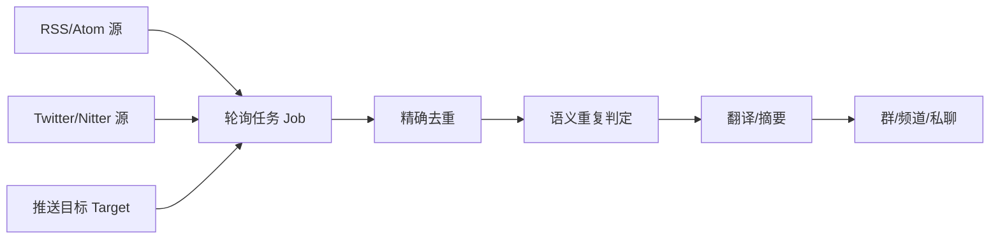
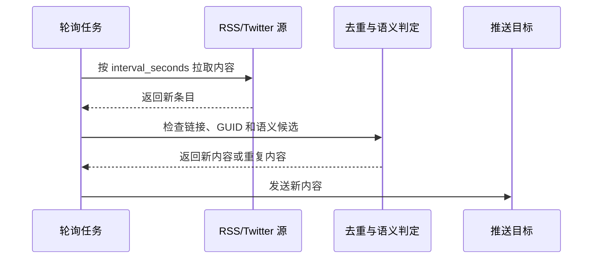

# astrbot_plugin_rss_forwarder（中文）

[English](./README.en.md) | [日本語](./README.ja.md)

`astrbot_plugin_rss_forwarder` 是一个面向 AstrBot 的 RSS / RSSHub / Twitter 推送编排插件，用于从多个订阅源拉取内容，并将结果按可视化配置的路由规则主动推送到指定平台会话（群/频道/私聊）。

## 定位

本项目不是对 `https://github.com/Soulter/astrbot_plugin_rss` 的简单重复实现，当前定位更偏向“RSS 推送编排”：

- 支持 RSS 去重持久化，避免重启后历史内容全量重推。
- 支持在插件面板中图形化定义 feed、target、job 和推送方式。
- 支持首轮启动延迟、历史条目抑制、无效 target 抑制等实际部署问题修复。
- 后续将扩展自动翻译、自动总结、Agent 辅助网页读取与图片提取等能力。

## 功能

- 支持多 RSS / Twitter 源（每个源可单独启用/禁用）。
- 支持 Twitter/Nitter 源：按推主用户名采集时间线，并可分别控制是否附带图片、视频。
- 支持鉴权：
  - `none`：公开链接；
  - `query`：在 URL 上自动附加 `key`；
  - `header`：通过 `Authorization: Bearer <key>` 发送。
- 支持任务级路由：一个 Job 绑定多个 feed + 多个 target。
- 支持定时执行：`interval_seconds`（已实现）与 `cron`（预留字段，当前回退到 interval）。
- 支持启动首轮延迟：默认在插件启动后等待 `45` 秒再执行第一次轮询，避免平台适配器尚未就绪时抢跑。
- 支持去重（KV + TTL）与 feed 状态（ETag/Last-Modified/last_success_time）。
- 支持任务级语义重复判定：同一轮询任务中多个源报道同一事件时，可通过模型判定后只推送首条代表新闻。
- 支持管理指令：`/rss list`、`/rss status`、`/rss run [job_id]`、`/rss pause [job_id]`、`/rss resume [job_id]`、`/rss reset`（清空去重记录）。
- 支持日报汇总：`daily_digests[]`、`/rss digest run [digest_id]`。
- 支持三级翻译链路：LLM、Google Translate、GitHub Models。
- 支持 text / image 两种渲染模式（image 使用 `html_render`）。

## 快速配置图示

本插件的核心配置由三类对象组成：源、目标和轮询任务。源负责提供内容，目标负责指定发送位置，轮询任务负责把一个或多个源发送到一个或多个目标。



单次轮询时，插件会按任务配置读取源、过滤旧内容、执行去重，再把新内容发送到目标。



## 从零开始配置

建议按“先建源、再建目标、最后建任务”的顺序配置。以下示例均为占位数据，`example.com`、`example_account`、`qq:group:example` 等值需要替换为实际可用信息。

### 1. 配置 RSS 源

在插件面板的 `feeds[]` 中新增一项，类型选择 `RSS/Atom 源`。

| 字段 | 示例值 | 用途 |
| --- | --- | --- |
| `id` | `vendor_blog_rss` | 供任务引用的唯一名称 |
| `url` | `https://example.com/feed.xml` | RSS/Atom 订阅地址 |
| `source_type` | `rss` | 源类型 |
| `auth_mode` | `none` | 公开 RSS 保持默认值即可 |
| `enabled` | `true` | 启用该源 |
| `timeout` | `10` | 拉取超时时间 |

需要 RSSHub 鉴权时，可把 `auth_mode` 改为 `query` 或 `header`，再填写 `key`。

### 2. 配置 Twitter/Nitter 源

在插件面板的 `feeds[]` 中新增一项，类型选择 `Twitter/Nitter 源`。

| 字段 | 示例值 | 用途 |
| --- | --- | --- |
| `id` | `vendor_status_twitter` | 供任务引用的唯一名称 |
| `source_type` | `twitter` | 源类型 |
| `username` | `example_account` | Twitter/X 用户名，填写不带 `@` 的账号名 |
| `nitter_url` | `https://nitter.example.com` | 可访问的 Nitter 镜像站 |
| `send_images` | `true` | 是否发送推文图片 |
| `send_videos` | `true` | 是否发送视频链接或媒体 |
| `send_link` | `true` | 是否附带原推文链接 |
| `max_new_items` | `1` | 每轮最多发送的新推文数量 |
| `enabled` | `true` | 启用该源 |

Twitter 源首次启用时会记录当前最新游标，后续轮询才发送新推文，避免首次启用时发送大量历史内容。

### 3. 配置推送目标

在插件面板的 `targets[]` 中新增一项。`unified_msg_origin` 是 AstrBot 用于识别会话的统一标识，实际值以 AstrBot 会话信息或平台适配器提供的信息为准。

| 字段 | 示例值 | 用途 |
| --- | --- | --- |
| `id` | `notification_group` | 供任务引用的唯一名称 |
| `platform` | `qq` | 平台名称 |
| `unified_msg_origin` | `qq:group:example` | 群、频道或私聊会话标识 |
| `enabled` | `true` | 启用该目标 |

示例中的 `qq:group:example` 仅表示格式占位，请勿照抄。

### 4. 配置轮询任务

在插件面板的 `jobs[]` 中新增一项，把已经创建的源和目标填入任务。

| 字段 | 示例值 | 用途 |
| --- | --- | --- |
| `id` | `news_poll` | 任务唯一名称 |
| `feed_ids[]` | `vendor_blog_rss`、`vendor_status_twitter` | 需要读取的源 |
| `target_ids[]` | `notification_group` | 需要发送的目标 |
| `interval_seconds` | `300` | 每 300 秒轮询一次 |
| `batch_size` | `5` | 每轮最多推送条目数 |
| `dedup_ttl_seconds` | `604800` | 精确去重记录保留 7 天 |
| `semantic_dedup_enabled` | `true` | 开启任务级语义重复判定 |
| `semantic_dedup_provider_id` | 从模型列表选择 | 用于重复判定的 AstrBot 模型 |
| `semantic_dedup_ttl_seconds` | `86400` | 语义候选保留 24 小时 |
| `semantic_dedup_max_candidates` | `20` | 每条新内容最多比较 20 条候选 |
| `semantic_dedup_min_confidence` | `0.82` | 判为重复所需置信度 |
| `enabled` | `true` | 启用该任务 |

语义重复判定只在同一个轮询任务内生效。多个源报道同一事件时，模型会比较新条目和该任务近期候选内容，置信度达到阈值后保留首条代表新闻。

### 5. 手动检查

配置保存后，可在会话中使用以下指令检查配置和执行状态。

```text
/rss list
/rss status
/rss run news_poll
```

`/rss run news_poll` 会立即执行一次指定任务，适合在正式等待排期前检查源、目标和模型配置是否正常。

## 与 `astrbot_plugin_rss` 的主要区别

- 更强调“推送编排”而不是基础订阅。
- 已实现去重持久化与重启恢复。
- 已实现可视化 feed/target/job 配置。
- 已实现启动阶段的稳态保护，减少平台未就绪时的误推送和误重试。
- 为后续 LLM/Agent 增强保留了清晰的处理管线。

## Twitter/Nitter 功能参考与致谢

本插件的 Twitter/Nitter 源实现参考了 [`Ars1027/astrbot_plugin_twitter`](https://github.com/Ars1027/astrbot_plugin_twitter) 以及实际部署中维护的 [`RhoninSeiei/astrbot_plugin_twitter`](https://github.com/RhoninSeiei/astrbot_plugin_twitter)。其中 Nitter 时间线读取、`since_id` 游标、媒体缓存等思路对本插件的设计有重要帮助。

两者定位不同：`astrbot_plugin_twitter` 更适合只需要 Twitter/X 推送、会话内关注管理、链接识别与合并转发的场景；本插件把 Twitter/Nitter 作为 `feeds[]` 的一种来源，统一进入 feed、job、target、去重、翻译和日报管线。只需要 Twitter 功能的用户，仍可按实际需求优先考虑原插件。

## 配置（插件面板）

本插件使用 `_conf_schema.json`，可在 AstrBot 插件面板中直接可视化配置：

- `feeds[]`：面板中显示为 `RSS/Twitter 源配置`，新增条目时分为 `RSS/Atom 源` 与 `Twitter/Nitter 源`
- `RSS/Atom 源`：`id`、`url`、`auth_mode`、`key`、`enabled`、`timeout`
- `Twitter/Nitter 源`：`id`、`username`、`nitter_url`、`proxy_url`、`send_images`、`send_videos`、`send_link`、`max_new_items`、`enabled`、`timeout`
- `targets[]`
  - `id`（唯一）
  - `platform`
  - `unified_msg_origin`（建议优先）
  - `enabled`
- `jobs[]`
  - `id`（唯一）
  - `feed_ids[]`
  - `target_ids[]`
  - `interval_seconds`（推荐）
  - `cron`（可填，当前版本回退到 interval）
  - `batch_size`
  - `dedup_ttl_seconds`（填 `0` 表示继承全局 TTL）
  - `semantic_dedup_enabled`
  - `semantic_dedup_provider_id`（可从 AstrBot 模型列表选择）
  - `semantic_dedup_ttl_seconds`（语义候选保留时间，默认 `86400` 秒）
  - `semantic_dedup_max_candidates`（每条新内容最多比较的候选数量，默认 `20`）
  - `semantic_dedup_min_confidence`（判为重复所需置信度，默认 `0.82`）
  - `enabled`
- `daily_digests[]`
  - `id`（唯一）
  - `title`
  - `feed_ids[]`
  - `target_ids[]`
  - `send_time`（`HH:MM`）
  - `window_hours`
  - `max_items`
  - `render_mode`（`text|image`）
  - `prompt_template`
  - `enabled`
- 翻译增强（`translation`）
  - `llm_enabled`：是否启用 LLM 摘要/翻译
  - `llm_provider_id`：LLM Provider（WebUI 可下拉选择）
  - `llm_timeout_seconds`：LLM 超时
  - `llm_profile`：LLM profile（高级）
  - `max_input_chars`：传给翻译器的最大输入字符数
  - `llm_proxy_mode` / `llm_proxy_url`：LLM 独立代理（尽力，是否生效取决于 Provider）
  - `google_translate_enabled`：是否启用 Google 翻译第一后备
  - `google_translate_api_key`：Google Cloud Translation API Key
  - `google_translate_target_lang`：目标语言（默认 `zh-CN`）
  - `google_translate_timeout_seconds`：Google 超时
  - `google_translate_proxy_mode` / `google_translate_proxy_url`：Google 独立代理
  - `github_models_enabled`：是否启用 GitHub Models 第二后备
  - `github_models_model`：GitHub Models 模型 ID
  - `github_models_timeout_seconds`：GitHub Models 超时
  - `github_models_token_file`：GitHub token 文件路径，默认按 `data/github.token` 解析
  - `github_models_proxy_mode` / `github_models_proxy_url`：GitHub Models 独立代理
- 其他
  - `dedup_ttl_seconds`
  - `startup_delay_seconds`
  - `render_mode`（`text|image`）
  - `display_source`
  - `display_time`
  - `display_link`
  - `summary_max_chars`
  - `render_card_template`

说明：
- 去重记录会同时写入 AstrBot KV 与 `data/plugin_data/astrbot_plugin_rss_forwarder/state.json`
- `jobs[].dedup_ttl_seconds` 大于 `0` 时，会覆盖全局 `dedup_ttl_seconds`；填 `0` 时继续使用全局值
- `jobs[].semantic_dedup_enabled=true` 时，插件会在精确去重之后、翻译和推送之前做语义重复判定
- 语义判定只读取当前 `job` 的候选记录，不会跨轮询任务互相影响
- `jobs[].semantic_dedup_ttl_seconds` 用于控制候选新闻保留时间；过期候选会从模型输入中移除
- 模型判定超时、缺少 provider 或返回无效 JSON 时，该条内容会继续推送
- 若条目发布时间早于该 feed 的 `last_success_time`，插件会仅补记去重而不重复推送
- `startup_delay_seconds` 默认为 `45`，用于给平台适配器和主动消息通道预留启动时间
- `translation` 下的全部字段都可在 AstrBot 插件面板中配置，无需手动修改 JSON 文件
- `daily_digests` 与 `jobs` 相互独立；只配置日报时，不会自动生成即时推送任务
- 日报默认在窗口内无条目时跳过发送，并在状态中记录 `empty_window`
- `source_type=twitter` 时，`url` 可留空；如需指定 Nitter 镜像站，优先填写 `nitter_url`
- `nitter_url` 支持填写自建 Nitter 服务地址，例如 `https://nitter.example.com`
- `display_source`、`display_time`、`display_link` 同时作用于文本推送与图片图卡
- Twitter 源可通过 `send_link=false` 单独隐藏原推文链接；来源仍显示为推主用户名
- Twitter 源首次启用时会先记录当前最新推文游标，后续轮询才发送新推文，避免首次启用时刷屏
- Twitter 源默认 `max_new_items=1`，每轮只抓取最新 1 条新推文；填 `0` 时会抓取全部新推文
- Twitter 图片和视频会优先缓存到 `data/plugin_data/astrbot_plugin_rss_forwarder/twitter_media` 后以本地文件发送，便于代理环境使用
- Twitter 源暂不处理聊天中的 Twitter/X 链接，也不使用合并转发消息

## 示例配置

```json
{
  "feeds": [
    {
      "id": "vendor_blog_rss",
      "url": "https://example.com/feed.xml",
      "source_type": "rss",
      "auth_mode": "none",
      "key": "",
      "enabled": true,
      "timeout": 10
    },
    {
      "id": "vendor_status_twitter",
      "source_type": "twitter",
      "username": "example_account",
      "nitter_url": "https://nitter.example.com",
      "proxy_url": "",
      "send_images": true,
      "send_videos": true,
      "send_link": true,
      "max_new_items": 1,
      "enabled": true,
      "timeout": 15
    }
  ],
  "targets": [
    {
      "id": "notification_group",
      "platform": "qq",
      "unified_msg_origin": "qq:group:example",
      "enabled": true
    }
  ],
  "jobs": [
    {
      "id": "news_poll",
      "feed_ids": ["vendor_blog_rss", "vendor_status_twitter"],
      "target_ids": ["notification_group"],
      "interval_seconds": 300,
      "batch_size": 5,
      "dedup_ttl_seconds": 604800,
      "semantic_dedup_enabled": true,
      "semantic_dedup_provider_id": "",
      "semantic_dedup_ttl_seconds": 86400,
      "semantic_dedup_max_candidates": 20,
      "semantic_dedup_min_confidence": 0.82,
      "enabled": true
    }
  ],
  "daily_digests": [
    {
      "id": "daily_news_digest",
      "title": "每日新闻摘要",
      "feed_ids": ["vendor_blog_rss"],
      "target_ids": ["notification_group"],
      "send_time": "09:00",
      "window_hours": 24,
      "max_items": 20,
      "render_mode": "text",
      "prompt_template": "请根据以下 RSS 条目生成一份简体中文日报，严格输出纯文本编号列表。\\n要求：\\n1) 只输出编号列表，不要导语、总结、分类标题或 Markdown 代码块；\\n2) 最多输出 {max_items} 条；\\n3) 每条一句话，优先保留来源信息；\\n4) 如果多条内容高度相近，可合并为一条更准确的概述。\\n\\n统计窗口：{window_start} 至 {window_end}\\n条目：\\n{items}",
      "enabled": true
    }
  ],
  "translation": {
    "llm_enabled": true,
    "llm_provider_id": "",
    "llm_timeout_seconds": 15,
    "llm_profile": "rss_enrich",
    "max_input_chars": 2000,
    "google_translate_enabled": true,
    "google_translate_api_key": "YOUR_GOOGLE_TRANSLATE_API_KEY",
    "google_translate_target_lang": "zh-CN",
    "google_translate_timeout_seconds": 15,
    "google_translate_proxy_mode": "system",
    "google_translate_proxy_url": "",
    "github_models_enabled": true,
    "github_models_model": "openai/gpt-4o-mini",
    "github_models_timeout_seconds": 15,
    "github_models_token_file": "github.token"
  },
  "render_mode": "text",
  "display_source": true,
  "display_time": true,
  "display_link": true
}
```


## 安装与环境依赖说明

### 1) 已修复的面板安装报错

若你遇到 `ModuleNotFoundError: No module named 'commands'`，这是由于旧版本插件使用了顶层导入方式（`from commands import ...`）导致的。

本仓库已修复为包内相对导入（`from .commands import ...`），可被 AstrBot 面板按 `astrbot_plugin_rss_forwarder.main` 正确加载。

### 2) 依赖对比（相对 AstrBot 默认环境）

本插件核心功能仅依赖：
- AstrBot 运行时（由 AstrBot 主程序提供）
- Python 标准库（`asyncio`、`urllib`、`xml`、`json` 等）

**结论：本插件没有必须额外 `pip install` 的第三方 Python 依赖。**

### 3) 可选能力说明

- `render_mode = image` 时，依赖 AstrBot 侧提供的 `html_render` 能力。
- `llm_enabled = true` 时，依赖 AstrBot 已配置可用的大模型提供商。
- `google_translate_enabled = true` 时，依赖 Google Cloud Translation API Key。
- `github_models_enabled = true` 时，默认从 `data/github.token` 读取 GitHub token，也可使用 `ASTRBOT_GITHUB_TOKEN`、`GITHUB_TOKEN` 或 `GH_TOKEN`。
- 翻译顺序：LLM -> Google -> GitHub Models。若仅开启其中一层，则直接使用该层。
- `source_type=twitter` 时，依赖可访问的 Nitter 镜像站；如运行环境访问受限，可在 feed 中配置 `proxy_url`。

若上述 AstrBot 能力未配置，本插件会记录日志并自动降级，不影响基础 RSS 文本推送。

## 翻译服务获取方式

### 1）AstrBot LLM Provider

在 AstrBot 主程序中先配置可用模型提供商，再进入插件面板的 `translation.llm_provider_id` 选择对应提供商。若留空，插件会尝试使用当前会话或默认模型。

### 2）Google Cloud Translation API Key

在 Google Cloud Console 创建项目，启用 `Cloud Translation API` 的 Basic v2，再在 `APIs & Services -> Credentials` 中创建 API Key。创建完成后，将 Key 填入插件面板的 `translation.google_translate_api_key`。

### 3）GitHub Models Token

在 GitHub 账户中创建带有 `models` 权限的 token，推荐放入 AstrBot `data` 目录映射的 `github.token` 文件，也可以通过环境变量 `ASTRBOT_GITHUB_TOKEN`、`GITHUB_TOKEN` 或 `GH_TOKEN` 提供。插件面板中的 `translation.github_models_token_file` 默认值就是 `github.token`。

## 开发参考

- Getting Started: https://docs.astrbot.app/dev/star/plugin-new.html
- Guides:
  - simple / listen-message-event / send-message / plugin-config
  - ai / storage / html-to-pic / session-control / other
- 文档索引：见 [docs/llm/README.md](./docs/llm/README.md)

## 路线图

见 [ROADMAP.md](./ROADMAP.md) 与 [docs/llm/roadmap.md](./docs/llm/roadmap.md)。

## 已知限制

- 当前未实现真正的 cron 调度器（配置 `cron` 时会回退到最小 interval 轮询）。
- 主动消息依赖平台能力，若平台不支持会记录错误日志。

## 日报任务建议

`daily_digests[]` 适合用于每天定时汇总一个或多个 feed 的重点条目。常见配置方式如下：

- `send_time` 设为固定日报时间，例如 `09:00`
- `window_hours` 设为 `24` 或 `72`
- `render_mode=text` 适合链接较多的场景
- `render_mode=image` 适合群内阅读体验优先的场景
- `prompt_template` 保持默认值即可开箱使用，若希望偏重某类信息，可在 GUI 中按需调整
